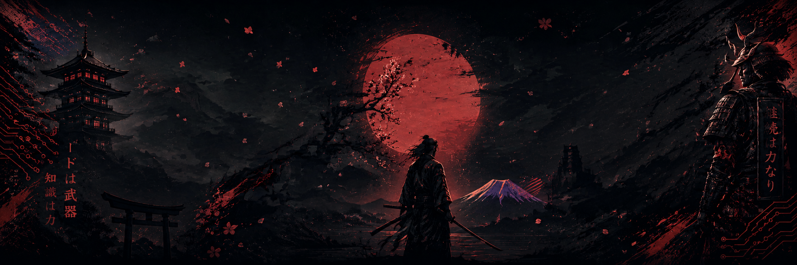

<h1 align="center"> Hello World I'm Plankton Dev  ! </h1>

<table border="0">
<tr border="0">
<td width="50%" border="0">

<h3> DevOps, Cloud & DevSecOps Engineer</h3>

<h4> 🚀 Building my career path in DevOps & Cloud </h4>

<h4> 🌱 Learning automation, security & infrastructure </h4>

<h4> 👯 Looking for teammates to learn together </h4>
 
<h4> 🤝 Open for collaboration and building projects </h4>

</td>

<td width="50%" border="0">

  

</td>
</tr>
</table>

<h3 align="left">Coding with me :3</h3>

  
  
  
  
  

## 🏆 My Tech Stack

### **DevOps**

  
  

 

  <a href="https://github.com/planktond3v">
    
    
    
   
  </a>

  

  
  

<picture>
  <source media="(prefers-color-scheme: dark)" srcset="https://raw.githubusercontent.com/Planktond3v/Planktond3v/pacman-output/pacman-contribution-graph-dark.svg">
  <source media="(prefers-color-scheme: light)" srcset="https://raw.githubusercontent.com/Planktond3v/Planktond3v/pacman-output/pacman-contribution-graph.svg">
  
</picture>

